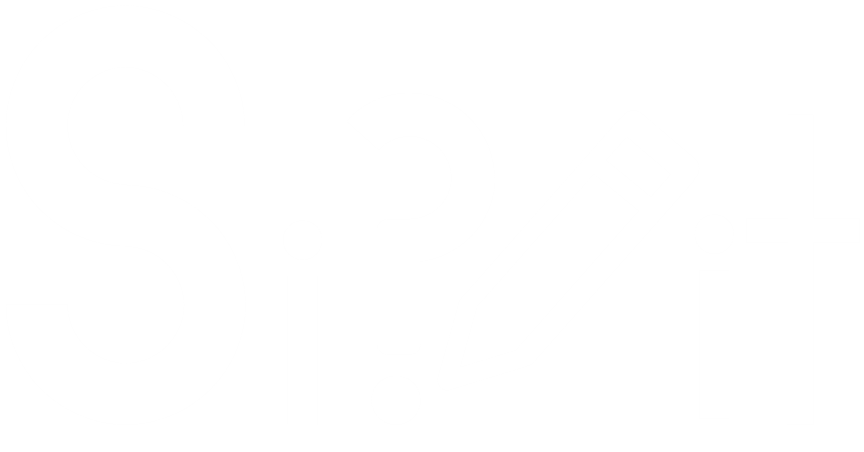

Should I Post It? (SIPit for short) is an open-source webapp made to predict a draft post's reception on Social Media through the use of Predictive Analytics

## Key Features
- Users are able to input their supposed draft post into the webapp's interface
- Analysis of the draft post using a pre-trained model for predictive analytics
- The webapp's model will then be able to make graphs and predictive results of how well the post will be received by the public.
- Complete with data visualization and insights to users if it would be worth it to post the text or not

## Usage
1. Go to <a href="should-i-post-it.vercel.app">should-i-post-it.vercel.app</a>
2. Enter the text of your post in the large textbox
3. Once the textbox has been filled with text, press the button titled "Should I Post IT?" to send the post to the model
4. Wait for site to redirect to the results page
5. Navigate through the three distinct result pages generated from the model (Reception Analysis, Community Feedback, Content Analysis)
6. Press the button titled "Try Another Post" to repeat steps 2.-5. with a new post

## The Model Results
Once the model has processed the post's text, it shows its results in the form of three pages: Reception Analysis, Community Feedback, and Content Analysis
### Reception Analysis
The Reception Analysis section compromises of two sub-sections: The Reception Level and the Reception Scores.

The <b>Reception Level</b> subsection shows a brief textual summary or category that is shown with the numeric reception scores.
The following Reception Levels that can show up are:
- 😊 $\color{green}{POSITIVE:}$ People will receive your post positively
- 🤔 $\color{yellow}{MIXED:}$ People will have mixed opinions about your post
- 😞 $\color{red}{NEGATIVE:}$ People will receive your post poorly

The <b>Reception Scores</b> subsection shows the numeric reception scores of the post through a donut chart and a gauge meter chart.
The following fields of the chart are: positive, neutral, and negative.

### Community Feedback
The Reception Analysis section compromises of two sub-sections: The Feedback Flag and The Classification 

The <b>Feedback Flag</b> sub-section shows a textual status or flag on how the community would flag your post text.
The following Feedback Flags that can show up are:
- 🟢 Green Flag: People will have no reason to flag your post for anything nor report it
- ⚠️ Yellow Flag: A warning flag that indicates that the post may get flagged or reported
- 🚩 Red Flag: A critical warning flag which implies that your post has a high chance of being flagged or reported

The <b>Classification</b> sub-section shows the possible labels or types of cyberbullying that your post can be labeled as
This sub-section will only appear if the Feedback Flag is <b>YELLOW</b> or <b>RED</b>.

- <b>Hate Speech</b>: Texts that express hatred
- <b>Insult</b>: Texts that directly attack or offend
- <b>Obscene</b>: Texts that are viewed as disgusting or inappropriate
- <b>Offensive Language</b>: Profanity or Vulgar texts
- <b>Toxic</b>: Texts that can affect mental health negatively
- <b>Severe Toxic</b>: Texts that severely affect mental health negatively
- <b>Threat</b>: Texts that communicate intent to inflict harm
- <b>Harassment</b>: Texts that violates a person's dignity
- <b>Sarcasm</b>: Ironic texts that are used to mock reality

### Content Analysis
The Content Analysis section analyzes each word of the post and pairs them with reception scores for better scrutinization of what word contributed to the overall reception score of the post

## Minor Features
- Text to Speech play and pause buttons for the textbox
- A button titled "Clear Text" appears to immediately clear the textbox once the post has text
- Appropriate Error Pages show up for unintended/unexpected happenings

## Tools
<b>Full Stack</b>
- Nuxt

<b>Frontend</b>
- Tailwind-CSS
- Nuxt-Charts
- Nuxt UI
- Vue

<b>Backend/Model Training</b>
- TensorFlow (tfjs)
- Jupyter Notebook/Python
- Kaggle (Source for Datasets)

 <b>Extra Tools</b>
- Vercel (Web hosting)

## Release

Source Code Release:
- <a href="https://github.com/BaxSTAR17/Should-I-Post-It-/releases/tag/should-i-post-it">Should I Post It v1.0</a>

## Credits

Made by:
- Baxter Gifford B. Bao-As
- Joseph Andrei F. Galicia
- Ghen Benedict M. Namol

## Feedback
Feedback can be received through filling out an <a href="https://github.com/BaxSTAR17/Should-I-Post-It-/issues/new" target="_blank">issue</a> or giving this repository some stars through GitHub.

